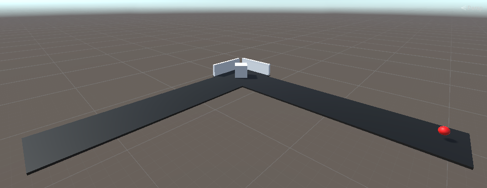
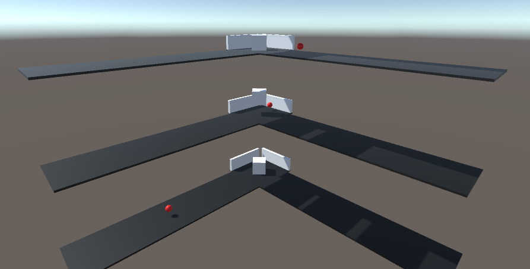

# Jumper Oefening

Menno Plochaet - S142947
Sam Van Wouwe - S120214

Welcome to the Jumper Exercise repository! In this project, our goal is to develop an AI agent capable of smoothly jumping over obstacles aproaching from two angles.

## Setup

This involves an agent who jumps over moving obstacles like its in the middle of an intersection.
The setup should look something like this.



Containing:
- Agent(cube)
- Spawns for the obstacles
- Obstacle prefab
- End walls

If you want to create a more efficient AI you can make this a prefab and place the prefab a couple of times so the agent trains in parallel.



## Goal

The goal of the assignement is to make the agent jump over the obstacles coming from two sides. 

## Agents

The environment contains one agent.

## Agent Reward Function

1. With each jump: -0.1
2. Agents get hit with obstacle: -1.0
3. The obstacle hits the backwall: +1.0

## Behavior Parameters

- Actions: 1 discrete action branch with 2 actions (jump and no jump).
- Visual Observations: None
- Float Properties: None

## Agent YAML File

```yaml
behaviors:
  jumper:
    trainer_type: ppo
    hyperparameters:
      batch_size: 128
      buffer_size: 2048
      learning_rate: 0.0003
      beta: 0.005
      epsilon: 0.2
      lambd: 0.9
      num_epoch: 5
      learning_rate_schedule: linear
      beta_schedule: constant
      epsilon_schedule: linear
    network_settings:
      normalize: false
      hidden_units: 128
      num_layers: 2
    reward_signals:
      extrinsic:
        gamma: 0.90
        strength: 1.0
    max_steps: 15000000
    time_horizon: 64
    summary_freq: 2000
```
<button onclick="toggleImages()">Toggle example images</button>
<div id="imageList" style="display: none;">
    
    
    
    <!-- Voeg hier meer afbeeldingen toe -->
</div>

<script>
    function toggleImages() {
        var imageList = document.getElementById("imageList");
        if (imageList.style.display === "none") {
            imageList.style.display = "block";
        } else {
            imageList.style.display = "none";
        }
    }
</script>
